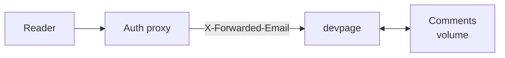

<Columns kicker="Deployed" title="Local for you. Deployed for your team — behind the proxy you already run.">

```mermaid
flowchart LR
  reader["Reader"] --> proxy["Auth proxy"]
  proxy -->|"X-Forwarded-Email"| devpage["devpage"]
  devpage <--> store["Comments<br/>volume"]
  click proxy href "../../boxes/viewer/deploying/README.md#the-auth-proxy" "The auth proxy"
  click devpage href "../../boxes/viewer/deploying/README.md" "Deploying devpage"
  click store href "../../boxes/viewer/comments/README.md#the-comment-store" "The comment store"
```

</Columns>
