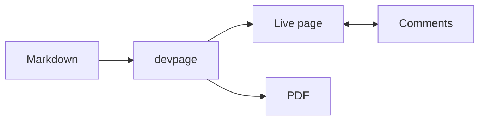

<Columns kicker="Diagrams" title="Diagrams readers can click through.">

```mermaid
flowchart LR
  md["Markdown"] --> devpage["devpage"]
  devpage --> page["Live page"]
  devpage --> pdf["PDF"]
  page <--> comments["Comments"]
  click md href "../../boxes/viewer/writing-a-document/README.md" "Writing a document"
  click devpage href "../../boxes/viewer/README.md" "The viewer"
  click page href "../../boxes/viewer/live-updates/README.md" "Live updates"
  click pdf href "../../boxes/viewer/pdf/README.md" "Printing to PDF"
  click comments href "../../boxes/viewer/comments/README.md" "Comments"
```

</Columns>
