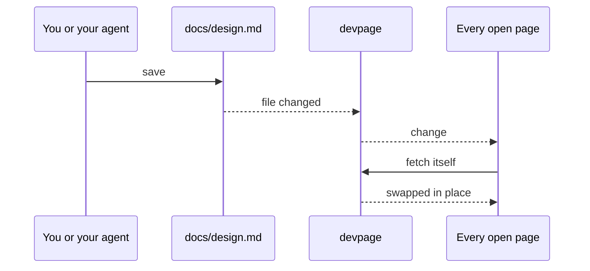

<Columns kicker="Live" title="Save a file. Every open page updates.">

```mermaid
sequenceDiagram
  participant You as You or your agent
  participant Disk as docs/design.md
  participant devpage
  participant Page as Every open page
  You->>Disk: save
  Disk-->>devpage: file changed
  devpage-->>Page: change
  Page->>devpage: fetch itself
  devpage-->>Page: swapped in place
```

</Columns>
