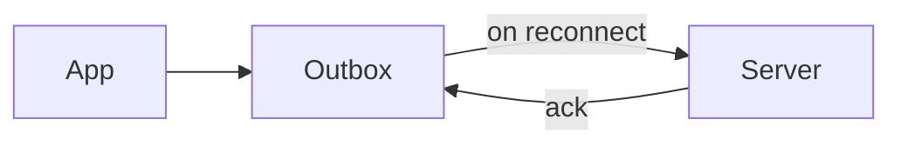

# Design

```mermaid
flowchart LR
  app["App"] --> outbox["Outbox"]
  outbox -->|"on reconnect"| server["Server"]
  server -->|"ack"| outbox
```

Each write gets a client-generated id, so the server can drop a replay — the
answer to the [risk](context.md#risks).

## Risks

The outbox grows without bound while offline.
